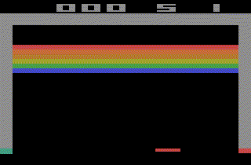
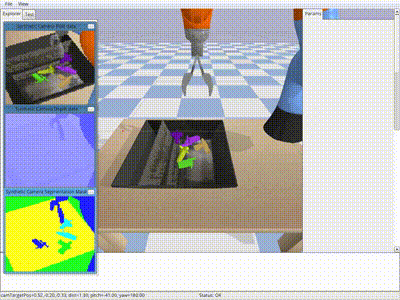
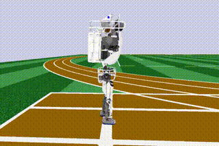

<div align="center"></div>

# ChainerRL and PFRL
[](https://travis-ci.org/chainer/chainerrl)
[](https://coveralls.io/github/chainer/chainerrl?branch=master)
[](http://chainerrl.readthedocs.io/en/latest/?badge=latest)
[](https://pypi.python.org/pypi/chainerrl)

ChainerRL (this repository) is a deep reinforcement learning library that implements various state-of-the-art deep reinforcement algorithms in Python using [Chainer](https://github.com/chainer/chainer), a flexible deep learning framework. [PFRL](https://github.com/pfnet/pfrl) is the PyTorch analog of ChainerRL.






## Installation

ChainerRL is tested with 3.6. For other requirements, see [requirements.txt](requirements.txt).

ChainerRL can be installed via PyPI:
```
pip install chainerrl
```

It can also be installed from the source code:
```
python setup.py install
```

Refer to [Installation](http://chainerrl.readthedocs.io/en/latest/install.html) for more information on installation. 

## Getting started

You can try [ChainerRL Quickstart Guide](examples/quickstart/quickstart.ipynb) first, or check the [examples](examples) ready for Atari 2600 and Open AI Gym.

For more information, you can refer to [ChainerRL's documentation](http://chainerrl.readthedocs.io/en/latest/index.html).

## Algorithms

| Algorithm | Discrete Action | Continous Action | Recurrent Model | Batch Training | CPU Async Training |
|:----------|:---------------:|:----------------:|:---------------:|:--------------:|:------------------:|
| DQN (including DoubleDQN etc.) | ✓ | ✓ (NAF) | ✓ | ✓ | x |
| Categorical DQN | ✓ | x | ✓ | ✓ | x |
| Rainbow | ✓ | x | ✓ | ✓ | x |
| IQN | ✓ | x | ✓ | ✓ | x |
| DDPG | x | ✓ | ✓ | ✓ | x |
| A3C  | ✓ | ✓ | ✓ | ✓ (A2C) | ✓ |
| ACER | ✓ | ✓ | ✓ | x | ✓ |
| NSQ (N-step Q-learning) | ✓ | ✓ (NAF) | ✓ | x | ✓ |
| PCL (Path Consistency Learning) | ✓ | ✓ | ✓ | x | ✓ |
| PPO  | ✓ | ✓ | ✓ | ✓ | x |
| TRPO | ✓ | ✓ | ✓ | ✓ | x |
| TD3 | x | ✓ | x | ✓ | x |
| SAC | x | ✓ | x | ✓ | x |

Following algorithms have been implemented in ChainerRL:
- [A2C (Synchronous variant of A3C)](https://openai.com/blog/baselines-acktr-a2c/)
  - examples: [[atari (batched)]](examples/atari/train_a2c_ale.py) [[general gym (batched)]](examples/gym/train_a2c_gym.py)
- [A3C (Asynchronous Advantage Actor-Critic)](https://arxiv.org/abs/1602.01783)
  - examples: [[atari reproduction]](examples/atari/reproduction/a3c) [[atari]](examples/atari/train_a3c_ale.py) [[general gym]](examples/gym/train_a3c_gym.py)
- [ACER (Actor-Critic with Experience Replay)](https://arxiv.org/abs/1611.01224)
  - examples: [[atari]](examples/atari/train_acer_ale.py) [[general gym]](examples/gym/train_acer_gym.py)
- [Asynchronous N-step Q-learning](https://arxiv.org/abs/1602.01783)
  - examples: [[atari]](examples/atari/train_nsq_ale.py)
- [Categorical DQN](https://arxiv.org/abs/1707.06887)
  - examples: [[atari]](examples/atari/train_categorical_dqn_ale.py) [[general gym]](examples/gym/train_categorical_dqn_gym.py)
- [DQN (Deep Q-Network)](https://storage.googleapis.com/deepmind-media/dqn/DQNNaturePaper.pdf) (including [Double DQN](https://arxiv.org/abs/1509.06461), [Persistent Advantage Learning (PAL)](https://arxiv.org/abs/1512.04860), Double PAL, [Dynamic Policy Programming (DPP)](http://www.jmlr.org/papers/volume13/azar12a/azar12a.pdf))
  - examples: [[atari reproduction]](examples/atari/reproduction/dqn) [[atari]](examples/atari/train_dqn_ale.py) [[atari (batched)]](examples/atari/train_dqn_batch_ale.py) [[flickering atari]](examples/atari/train_drqn_ale.py) [[general gym]](examples/gym/train_dqn_gym.py)
- [DDPG (Deep Deterministic Policy Gradients)](https://arxiv.org/abs/1509.02971) (including [SVG(0)](https://arxiv.org/abs/1510.09142))
  - examples: [[mujoco reproduction]](examples/mujoco/reproduction/ddpg) [[mujoco]](examples/mujoco/train_ddpg_gym.py) [[mujoco (batched)]](examples/mujoco/train_ddpg_batch_gym.py)
- [IQN (Implicit Quantile Networks)](https://arxiv.org/abs/1806.06923)
  - examples: [[atari reproduction]](examples/atari/reproduction/iqn) [[general gym]](examples/gym/train_iqn_gym.py)
- [PCL (Path Consistency Learning)](https://arxiv.org/abs/1702.08892)
  - examples: [[general gym]](examples/gym/train_pcl_gym.py)
- [PPO (Proximal Policy Optimization)](https://arxiv.org/abs/1707.06347)
  - examples: [[mujoco reproduction]](examples/mujoco/reproduction/ppo) [[atari]](examples/atari/train_ppo_ale.py) [[mujoco]](examples/mujoco/train_ppo_gym.py) [[mujoco (batched)]](examples/mujoco/train_ppo_batch_gym.py)
- [Rainbow](https://arxiv.org/abs/1710.02298)
  - examples: [[atari reproduction]](examples/atari/reproduction/rainbow)
- [REINFORCE](http://www-anw.cs.umass.edu/~barto/courses/cs687/williams92simple.pdf)
  - examples: [[general gym]](examples/gym/train_reinforce_gym.py)
- [SAC (Soft Actor-Critic)](https://arxiv.org/abs/1812.05905)
  - examples: [[mujoco reproduction]](examples/mujoco/reproduction/soft_actor_critic)
- [TRPO (Trust Region Policy Optimization)](https://arxiv.org/abs/1502.05477) with [GAE (Generalized Advantage Estimation)](https://arxiv.org/abs/1506.02438)
  - examples: [[mujoco]](examples/mujoco/train_trpo_gym.py)
- [TD3 (Twin Delayed Deep Deterministic policy gradient algorithm)](https://arxiv.org/abs/1802.09477)
  - examples: [[mujoco reproduction]](examples/mujoco/reproduction/td3)

Following useful techniques have been also implemented in ChainerRL:
- [NoisyNet](https://arxiv.org/abs/1706.10295)
  - examples: [[Rainbow]](examples/atari/reproduction/rainbow) [[DQN/DoubleDQN/PAL]](examples/atari/train_dqn_ale.py)
- [Prioritized Experience Replay](https://arxiv.org/abs/1511.05952)
  - examples: [[Rainbow]](examples/atari/reproduction/rainbow) [[DQN/DoubleDQN/PAL]](examples/atari/train_dqn_ale.py)
- [Dueling Network](https://arxiv.org/abs/1511.06581)
  - examples: [[Rainbow]](examples/atari/reproduction/rainbow) [[DQN/DoubleDQN/PAL]](examples/atari/train_dqn_ale.py)
- [Normalized Advantage Function](https://arxiv.org/abs/1603.00748)
  - examples: [[DQN]](examples/gym/train_dqn_gym.py) (for continuous-action envs only)
- [Deep Recurrent Q-Network](https://arxiv.org/abs/1507.06527)
  - examples: [[DQN]](examples/atari/train_drqn_ale.py)


## Visualization

ChainerRL has a set of accompanying [visualization tools](https://github.com/chainer/chainerrl-visualizer) in order to aid developers' ability to understand and debug their RL agents. With this visualization tool, the behavior of ChainerRL agents can be easily inspected from a browser UI.


## Environments

Environments that support the subset of OpenAI Gym's interface (`reset` and `step` methods) can be used.

## Contributing

Any kind of contribution to ChainerRL would be highly appreciated! If you are interested in contributing to ChainerRL, please read [CONTRIBUTING.md](CONTRIBUTING.md).

## License

[MIT License](LICENSE).

## Citations

To cite ChainerRL in publications, please cite our [JMLR paper](https://www.jmlr.org/papers/v22/20-376.html):

```
@article{JMLR:v22:20-376,
  author  = {Yasuhiro Fujita and Prabhat Nagarajan and Toshiki Kataoka and Takahiro Ishikawa},
  title   = {ChainerRL: A Deep Reinforcement Learning Library},
  journal = {Journal of Machine Learning Research},
  year    = {2021},
  volume  = {22},
  number  = {77},
  pages   = {1-14},
  url     = {http://jmlr.org/papers/v22/20-376.html}
}
```
