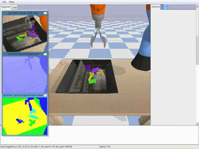

# Bullet-based robotic grasping

This directory contains example scripts that learn to grasp objects in an environment simulated by Bullet, a physics simulator.



## Files

- `train_dqn_batch_grasping.py`: DoubleDQN + prioritized experience replay

## Requirements

- pybullet>=2.4.9

## How to run

Train with one simulator, which is slow.
```
python examples/grasping/train_dqn_batch_grasping.py
```

Train with 96 simulators run in parallel, which is faster.
```
python examples/grasping/train_dqn_batch_grasping.py --num-envs 96
```

Watch how the learned agent performs. `<path to agent>` must be a path to a directory where the agent was saved (e.g. `2000000_finish` created inside the output directory specified as `--outdir`).
```
python examples/grasping/train_dqn_batch_grasping.py --demo --render --load <path to agent>
```

### Useful Options
- `--gpu`. Specifies the GPU. If you do not have a GPU on your machine, run the example with the option `--gpu -1`. E.g. `python train_dqn_batch_grasping.py --gpu -1`.
- `--num-envs` Specifies the number of parallel environments to spawn, e.g. `--num-envs 96`
- `--env`. Specifies the environment. 
- `--render`. Add this option to render the states in a GUI window.
- `--seed`. This option specifies the random seed used.
- `--outdir` This option specifies the output directory to which the results are written.

## Results

These results were obtained by training the example file on 24 CPUs, a single GPU, for 96 environments. This was trained for 1.79 days, for 20M timesteps. After every 100K timesteps, the agent is evaluated for 100 episodes. The highest achieved grasping performance during training is 81%, where a success corresponds to a successful grasp of any object.


