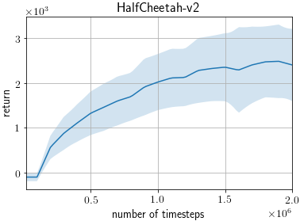
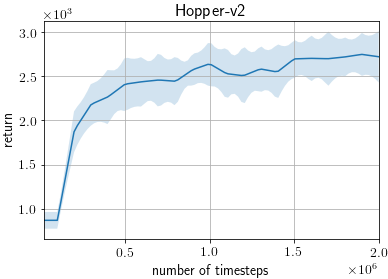
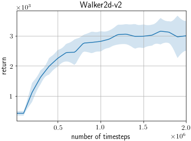
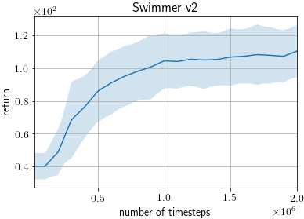

# PPO on MuJoCo benchmarks

This example trains a PPO agent ([Proximal Policy Optimization Algorithms](http://arxiv.org/abs/1707.06347)) on MuJoCo benchmarks from OpenAI Gym.

We follow the training and evaluation settings of [Deep Reinforcement Learning that Matters](https://arxiv.org/abs/1709.06560), which provides thorough, highly tuned benchmark results.

## Requirements

- MuJoCo Pro 1.5
- mujoco_py>=1.50, <2.1

## Running the Example

```
python train_ppo.py [options]
```

### Useful Options

- `--gpu`. Specifies the GPU. If you do not have a GPU on your machine, run the example with the option `--gpu -1`. E.g. `python train_ppo.py --gpu -1`.
- `--env`. Specifies the environment. E.g. `python train_ppo.py --env HalfCheetah-v2`.
- `--render`. Add this option to render the states in a GUI window.
- `--seed`. This option specifies the random seed used.
- `--outdir` This option specifies the output directory to which the results are written.

To view the full list of options, either view the code or run the example with the `--help` option.

## Known differences

- While the original paper initialized weights by normal distribution (https://github.com/Breakend/baselines/blob/50ffe01d254221db75cdb5c2ba0ab51a6da06b0a/baselines/ppo1/mlp_policy.py#L28), we use orthogonal initialization as the latest openai/baselines does (https://github.com/openai/baselines/blob/9b68103b737ac46bc201dfb3121cfa5df2127e53/baselines/a2c/utils.py#L61).

## Results

These scores are evaluated by average return +/- standard error of 100 evaluation episodes after 2M training steps.

Reported scores are taken from Table 1 of [Deep Reinforcement Learning that Matters](https://arxiv.org/abs/1709.06560).

ChainerRL scores are based on 20 trials using different random seeds, using the following command.

```
python train_ppo.py --gpu -1 --seed [0-19] --env [env]
```

| Environment    | ChainerRL Score | Reported Score |
| -------------- |:---------------:|:--------------:|
| HalfCheetah-v2 |  **2404**+/-185 |     2201+/-323 |
| Hopper-v2      |       2719+/-67 |  **2790**+/-62 |
| Walker2d-v2    |      2994+/-113 |            N/A |
| Swimmer-v2     |         111+/-4 |            N/A |

### Learning Curves

The shaded region represents a standard deviation of the average evaluation over 20 trials.





