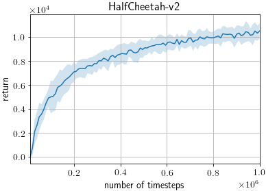
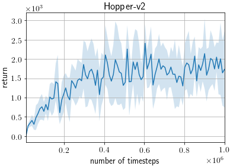
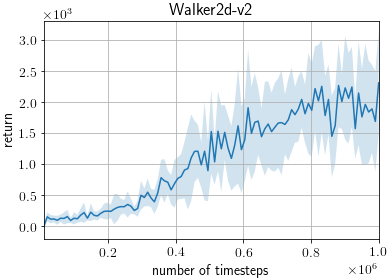
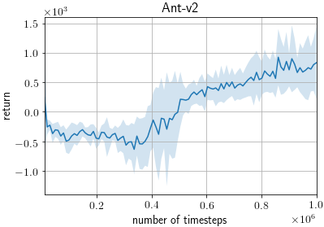
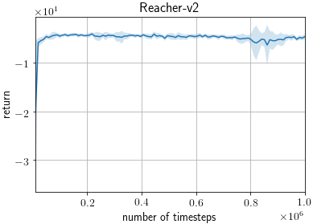
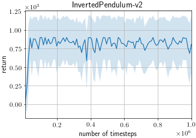
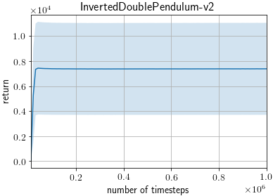

# DDPG on MuJoCo benchmarks

This example trains a DDPG agent ([Continuous Control with Deep Reinforcement Learning](https://arxiv.org/abs/1509.02971)) on MuJoCo benchmarks from OpenAI Gym.

We follow the training and evaluation settings of [Addressing Function Approximation Error in Actor-Critic Methods](http://arxiv.org/abs/1802.09477), which provides thorough, highly tuned benchmark results.

## Requirements

- MuJoCo Pro 1.5
- mujoco_py>=1.50, <2.1

## Running the Example

```
python train_ddpg.py [options]
```

### Useful Options

- `--gpu`. Specifies the GPU. If you do not have a GPU on your machine, run the example with the option `--gpu -1`. E.g. `python train_ddpg.py --gpu -1`.
- `--env`. Specifies the environment. E.g. `python train_ddpg.py --env HalfCheetah-v2`.
- `--render`. Add this option to render the states in a GUI window.
- `--seed`. This option specifies the random seed used.
- `--outdir` This option specifies the output directory to which the results are written.

To view the full list of options, either view the code or run the example with the `--help` option.

## Results

ChainerRL scores are based on 10 trials using different random seeds, using the following command.

```
python train_ddpg.py --seed [0-9] --env [env]
```

During each trial, the agent is trained for 1M timesteps and evaluated after every 5000 timesteps, resulting in 200 evaluations.
Each evaluation reports average return over 10 episodes without exploration noise.

### Max Average Return

Maximum evaluation scores, averaged over 10 trials, are reported for each environment.

Reported scores are taken from the "Our DDPG" column of Table 1 of [Addressing Function Approximation Error in Actor-Critic Methods](http://arxiv.org/abs/1802.09477).

| Environment               | ChainerRL Score | Reported Score |
| ------------------------- |:---------------:|:--------------:|
| HalfCheetah-v2            |    **10797.04** |        8577.29 |
| Hopper-v2                 |     **3565.60** |        1860.02 |
| Walker2d-v2               |     **3594.26** |        3098.11 |
| Ant-v2                    |     **1505.47** |         888.77 |
| Reacher-v2                |       **-2.92** |          -4.01 |
| InvertedPendulum-v2       |          902.25 |    **1000.00** |
| InvertedDoublePendulum-v2 |         7495.56 |    **8369.95** |


### Last 100 Average Return

Average return of last 10 evaluation scores, averaged over 10 trials, are reported for each environment.

Reported scores are taken from the "AHE" row of Table 2 of [Addressing Function Approximation Error in Actor-Critic Methods](http://arxiv.org/abs/1802.09477).

| Environment               | ChainerRL Score | Reported Score |
| ------------------------- |:---------------:|:--------------:|
| HalfCheetah-v2            |    **10325.45** |        8401.02 |
| Hopper-v2                 |     **1786.16** |        1061.77 |
| Walker2d-v2               |         1924.87 |    **2362.13** |
| Ant-v2                    |      **774.46** |         564.07 |
| Reacher-v2                |           -4.88 |            N/A |
| InvertedPendulum-v2       |          784.79 |            N/A |
| InvertedDoublePendulum-v2 |         7385.12 |            N/A |

### Learning Curves

The shaded region represents a standard deviation of the average evaluation over 10 trials.








