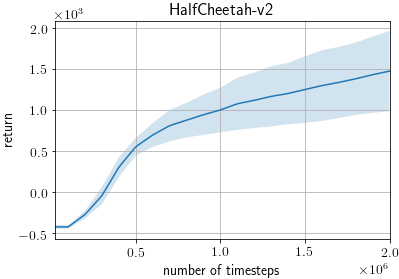
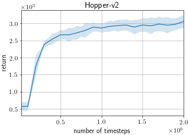
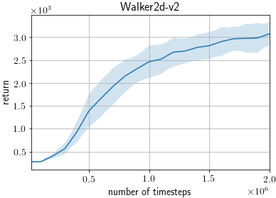
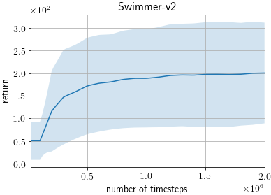

# TRPO on MuJoCo benchmarks

This example trains a TRPO agent ([Trust Region Policy Optimization](https://arxiv.org/abs/1502.05477)) on MuJoCo benchmarks from OpenAI Gym.

We follow the training and evaluation settings of [Deep Reinforcement Learning that Matters](https://arxiv.org/abs/1709.06560), which provides thorough, highly tuned benchmark results.

## Requirements

- MuJoCo Pro 1.5
- mujoco_py>=1.50, <2.1

## Running the Example

```
python train_trpo.py [options]
```

### Useful Options

- `--gpu`. Specifies the GPU. If you do not have a GPU on your machine, run the example with the option `--gpu -1`. E.g. `python train_trpo.py --gpu -1`.
- `--env`. Specifies the environment. E.g. `python train_trpo.py --env HalfCheetah-v2`.
- `--render`. Add this option to render the states in a GUI window.
- `--seed`. This option specifies the random seed used.
- `--outdir` This option specifies the output directory to which the results are written.

To view the full list of options, either view the code or run the example with the `--help` option.

## Known differences

- We used version v2 of the environments whereas the original results were reported for version v1, however this doesn't seem to introduce significant differences: https://github.com/openai/gym/pull/834

## Results

These scores are evaluated by average return +/- standard error of 100 evaluation episodes after 2M training steps.

Reported scores are taken from the row Table 1 of [Deep Reinforcement Learning that Matters](https://arxiv.org/abs/1709.06560).
Here we try to reproduce TRPO (Schulman et al. 2017) of the (64, 64) column, which corresponds to the default settings.

| Environment | ChainerRL Score | Reported Score |
| ----------- |:---------------:|:--------------:|
| HalfCheetah |  **1474**+/-112 |      205+/-256 |
| Hopper      |   **3056**+/-44 |      2828+/-70 |
| Walker2d    |       3073+/-59 |            N/A |
| Swimmer     |        200+/-25 |            N/A |

### Learning Curves

The shaded region represents a standard deviation of the average evaluation over 20 trials.





